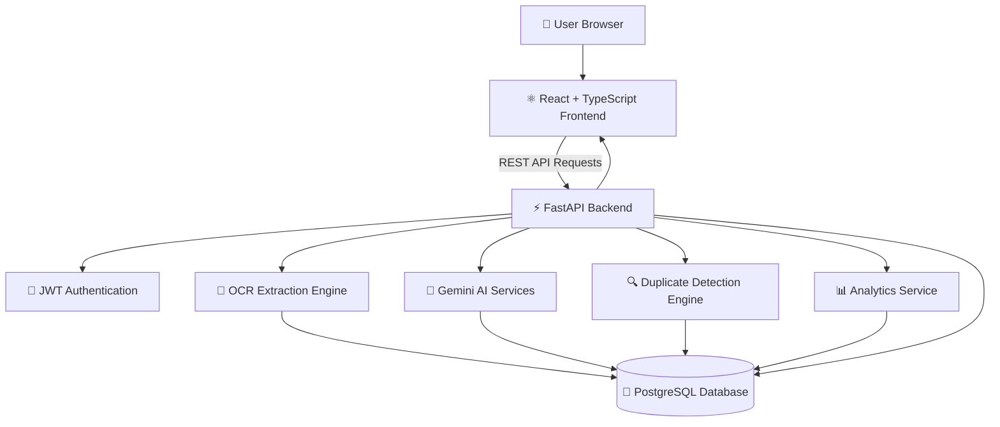
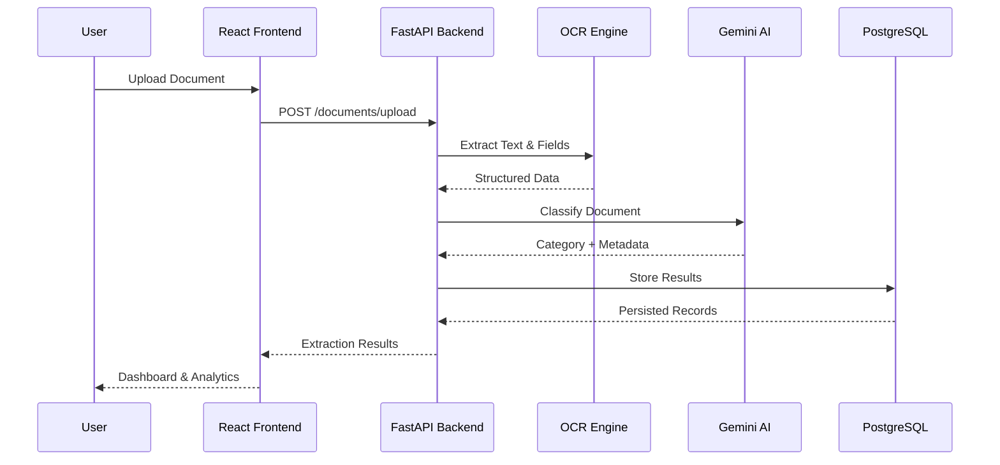
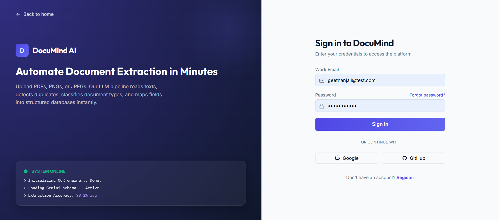
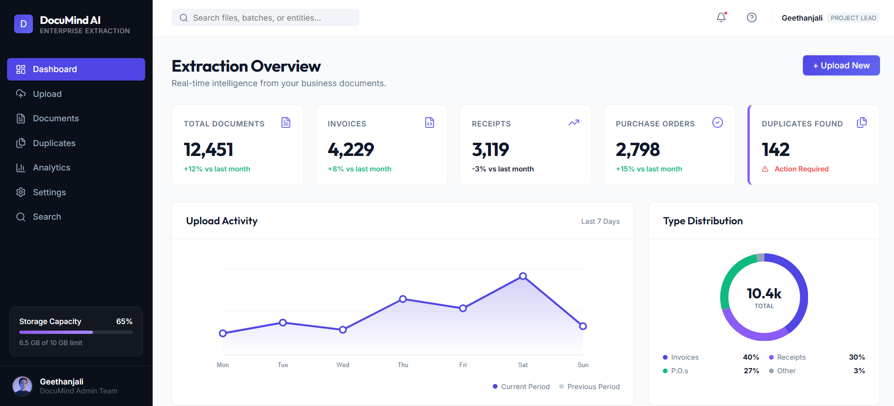
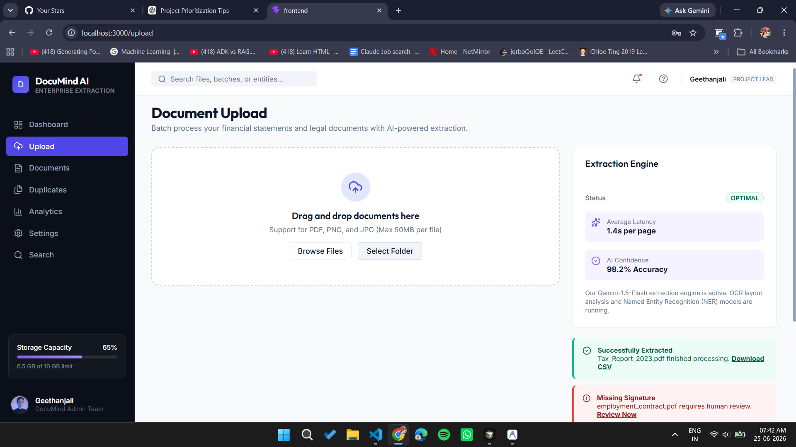
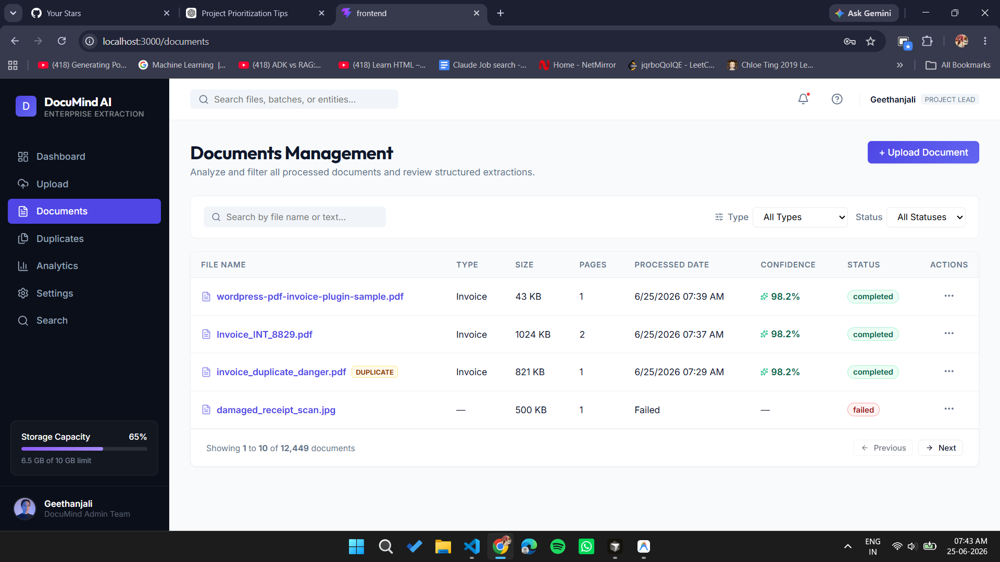
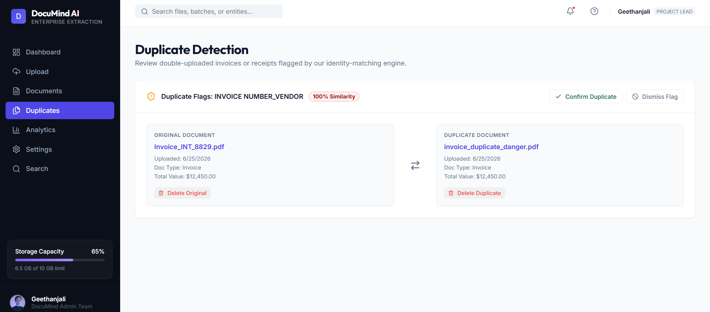
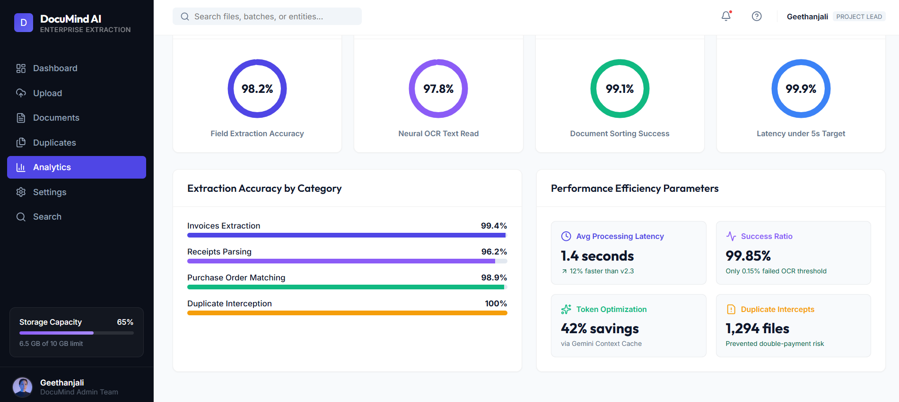

# DocuMind AI – Enterprise Document Intelligence & Extraction Platform

DocuMind AI is an AI-powered enterprise document intelligence platform that automates document ingestion, OCR extraction, document classification, duplicate detection, and analytics. The platform transforms unstructured business documents into searchable, actionable intelligence through an interactive dashboard and real-time insights.


## 🚀 Features

### 📄 AI-Powered OCR Extraction
- Extract text and structured fields from invoices, receipts, purchase orders, and business documents
- High-accuracy OCR pipeline for scanned and digital documents
- Automated field extraction and metadata generation

### 🧠 Intelligent Document Classification
- Automatically classify uploaded documents into categories
- AI-assisted extraction and categorization pipeline
- Supports invoices, receipts, purchase orders, and custom document types

### 🔍 Duplicate Detection Engine
- Detect duplicate invoices and receipts
- Invoice number matching
- Vendor similarity detection
- Duplicate confidence scoring
- Fraud prevention workflows

### 📑 Document Management Console
- View processed documents
- Search and filter documents
- Metadata management
- Processing status tracking
- Document lifecycle management

### 📊 Real-Time Analytics Dashboard
- Field extraction accuracy metrics
- OCR confidence scores
- Processing latency monitoring
- Success ratio tracking
- Operational insights and reporting

### 📱 Responsive Enterprise Dashboard
- Fully responsive UI
- Mobile, tablet, and desktop support
- Modern dashboard interface
- Real-time data visualization

---

# 🛠️ Tech Stack

## Frontend
- **Framework:** React.js + TypeScript + Vite
- **Styling:** Tailwind CSS
- **Charts:** Recharts
- **State Management:** React Hooks & Context API
- **Icons:** Lucide React

## Backend
- **Framework:** FastAPI (Python 3.11)
- **Database:** PostgreSQL
- **ORM:** SQLAlchemy
- **Authentication:** JWT Authentication
- **AI Services:** Gemini AI APIs
- **OCR Engine:** Document OCR & Information Extraction Pipeline

---

# 📐 Architecture Diagram



---

# 🔄 Document Processing Flow



---

# 🚀 Core Modules

## 📄 Document Upload
- Drag-and-drop uploads
- PDF and image support
- Batch upload capabilities
- Upload progress tracking

## 📑 Document Management
- View processed documents
- Search and filtering
- Metadata management
- Processing status tracking

## 🔍 Duplicate Detection
- Invoice number matching
- Vendor similarity detection
- Duplicate confidence scoring
- Fraud prevention workflows

## 📊 Analytics Dashboard
- Extraction accuracy monitoring
- OCR confidence tracking
- Processing latency analysis
- Success ratio monitoring
- Operational reporting

---

# 📸 Application Screenshots

## Authentication


## Dashboard Overview


## Document Upload


## Documents Management


## Duplicate Detection


## Analytics Dashboard


---

# 📦 Installation & Configuration

## Prerequisites
- Python 3.11+
- Node.js 18+
- PostgreSQL
- Gemini API Key

---

# 1️⃣ Backend Setup

```bash
cd backend

python -m venv .venv

# Windows
.venv\Scripts\activate

# Linux/Mac
source .venv/bin/activate

pip install -r requirements.txt
```

Create a `.env` file:

```env
DATABASE_URL=your_postgresql_connection_string
SECRET_KEY=your_secret_key
GEMINI_API_KEY=your_gemini_api_key
ALGORITHM=HS256
ACCESS_TOKEN_EXPIRE_MINUTES=60
```

Run the server:

```bash
uvicorn app.main:app --reload
```

Backend URL:

```
http://127.0.0.1:8000
```

Swagger Documentation:

```
http://127.0.0.1:8000/docs
```

---

# 2️⃣ Frontend Setup

```bash
cd frontend

npm install
npm run dev
```

Frontend URL:

```
http://localhost:3000
```

---

# 📡 API Endpoints

## Authentication
- `POST /auth/register`
- `POST /auth/login`
- `GET /users/me`

## Document Operations
- `POST /api/v1/documents/upload`
- `GET /api/v1/documents`
- `GET /api/v1/documents/{id}`
- `DELETE /api/v1/documents/{id}`

## Duplicate Detection
- `GET /api/v1/duplicates`
- `POST /api/v1/duplicates/analyze`

## Analytics
- `GET /api/v1/stats`
- `GET /api/v1/search`

---

# 🛡️ Environment Variables

## Backend (`backend/.env`)

```env
DATABASE_URL=
SECRET_KEY=
GEMINI_API_KEY=
ALGORITHM=HS256
ACCESS_TOKEN_EXPIRE_MINUTES=60
```

## Frontend (`frontend/.env`)

```env
VITE_API_URL=http://127.0.0.1:8000
```

---

# 🌐 Deployment Guide

## Backend

```bash
docker build -t documind-backend .
docker run -p 8000:8000 documind-backend
```

Deployment Platforms:
- Render
- Railway
- AWS ECS
- Google Cloud Run

## Frontend

```bash
npm run build
```

Deployment Platforms:
- Vercel
- Netlify
- AWS Amplify

---

# 🔮 Future Enhancements

- Role-Based Access Control (RBAC)
- Vector Search for Semantic Document Retrieval
- RAG-Powered Document Question Answering
- Real-Time Processing Queues using Celery and Redis
- Multi-Tenant Enterprise Workspaces
- Cloud Storage Integration (AWS S3 / GCS)
- CI/CD Pipeline with GitHub Actions
- Docker Compose and Kubernetes Deployment
- AI-Powered Document Summarization
- Document Chat Assistant

---

# 📈 Project Highlights

- AI-Powered Enterprise Document Intelligence Platform
- End-to-End OCR Extraction Pipeline
- Duplicate Invoice Detection System
- Real-Time Analytics Dashboard
- FastAPI + React Full-Stack Architecture
- Gemini AI Integration
- Responsive Enterprise UI
- Production-Ready Modular Architecture

---

# ✍️ Author

**Geethanjali V N**

GitHub: https://github.com/Geethanjaliii

Project Repository:
https://github.com/Geethanjaliii/DocumindAI

---

# 📄 License

This project is licensed under the MIT License.
